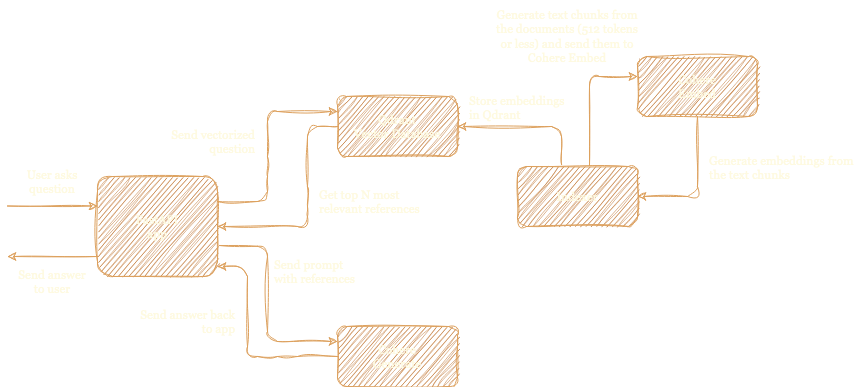

# mindmate: Your AI-Powered Knowledge Assistant

mindmate is an AI-powered assistant that lets you effortlessly navigate your company's internal knowledge base.

## How it works

1. mindmate processes and creates embeddings of the internal
   knowledge base using Cohere.
2. It stores the embeddings with Qdrant and uses it to retrieve them
   when a user asks a question.
3. It leverages Cohere's generation capabilities to provide natural
   language answers to user questions.
4. The chatbot uses a web interface built with FastAPI and htmx to
   provide an easy-to-use experience.

Here's a diagram of the architecture:



## Development

To run the project locally, you need to install `poetry` and then create a virtual environment with the required libraries using `poetry install`.

After that, you can run the server using `uvicorn main:app --reload`.

I use Tailwind to style the web interface. After you've installed it, you can compile the css by running the following command:

```shell
npx tailwindcss -i ./gitlab_search_bot/app/assets/style.css -o ./gitlab_search_bot/app/static/style.css --watch --minify
```

## Deployment

You can deploy the project to a VPS by running the scripts in `deployment/` in this order:

```shell
bash init.sh
bash deploy.sh
```

Make sure to update `utils.sh` to reflect your domain name and repository.
